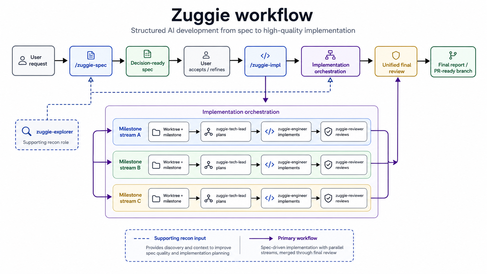

# Zuggie

Zuggie is a public RAC config pack for structured AI development workflows, with explicit planning, implementation, review, and debug roles.



## Default workflow

`/zuggie-spec` is the default entrypoint. It produces a decision-ready specification. After you review and accept/refine that spec, `/zuggie-impl` executes from the accepted spec using worktrees, milestones, engineers, and reviewers.

## What you get

- `/zuggie-spec` — Build a decision-ready implementation spec for a change.
- `/zuggie-impl` — Implement from an accepted spec using milestone-based execution in a dedicated worktree.
- `/zuggie-structured-debug` — Structured debugging workflow (WIP/experimental).
- Agents: `zuggie-tech-lead`, `zuggie-engineer`, `zuggie-reviewer`, `zuggie-debugger`, `zuggie-explorer`.
- Roles are tuned across model tiers and reasoning effort: fast explorer passes, higher-reasoning planning/review/debug, and medium-effort implementation.

Planning, implementation, review, and debug are intentionally separated into explicit roles so each stage has clear ownership and outputs.

## Prerequisites

- Claude Code and/or Codex CLI.
- RAC CLI — Node 20 or later required. Install/run via `npx github:raniejade/rac`. See https://github.com/raniejade/rac.

## Install

```bash
rac pack add zuggie github:raniejade/zuggie --ref <ref>
rac install --target claude,codex --kind agent,skill
```

Use ``--ref v<X.Y.Z>`` for a stable release (e.g. ``--ref v0.2.0``). See [Releases](https://github.com/raniejade/zuggie/releases) for available tags.

## Generated output locations

`rac install --target claude,codex --kind agent,skill` generates into standard vendor locations in the target project:

- Claude agents/skills under `.claude/`
- Codex agents under `.codex/agents/`
- Codex skills under `.agents/skills/`

## Usage

```
/zuggie-spec add a cache invalidation policy for X
/zuggie-impl implement the accepted spec above
```

WIP/experimental debug path:

```
/zuggie-structured-debug Y fails when Z
```

## Validation

```bash
npx -y github:raniejade/rac#v0.3.0 doctor --target claude,codex --kind agent,skill
npx -y github:raniejade/rac#v0.3.0 install --target claude,codex --kind agent,skill --dry-run
```

CI runs these same checks on every PR and push to main.

## Contributing — changelog entries

Run `npx -y @changesets/cli@^2.27 add` and commit the resulting `.changeset/*.md` file alongside your change.
Include one for every PR that has a user-visible effect; omit it for pure docs or CI changes.

## Source of truth

- `.rac/config.toml`
- `.rac/agents/*.toml`
- `.rac/agents/*.tpl.md`
- `.rac/skills/*/SKILL.tpl.md`

## License

MIT — see [LICENSE](LICENSE).
